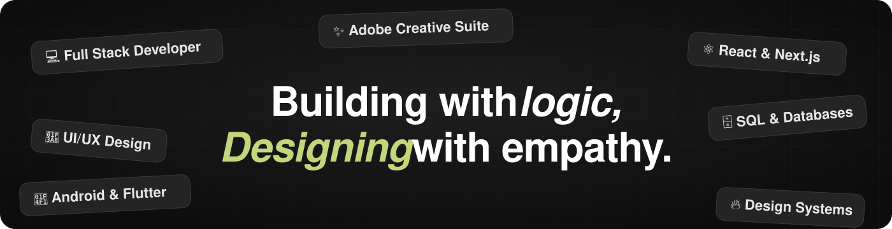

<!-- ======================= HERO / HEADER ======================= -->
<div align="center">



### Hi there, I'm Taksakaa 👋 &nbsp;•&nbsp; Full Stack Developer & Graphic Designer

<p>
  
  
</p>

<!-- GANTI_INI: replace the usernames/number below with your own -->
<a href="https://linkedin.com/in/GANTI_INI"></a>
<a href="https://instagram.com/GANTI_INI"></a>
<a href="https://wa.me/62GANTI_INI"></a>
<a href="mailto:aprillianravi389@gmail.com"></a>

</div>

<!-- ======================= ABOUT ME ======================= -->
## 🚀 About Me

```yaml
name:      Taksakaa
role:      Full Stack Developer • Mobile Developer • Graphic Designer
based_in:  Indonesia 🇮🇩
focus:     Building web & mobile products end-to-end, plus visual design
mindset:   "Clean code, clean pixels — always learning, always shipping."
```

- 💻 I build **web** and **mobile** apps from idea to production
- 🎨 I also do **graphic & visual design** — illustration, photo editing, and video
- 🧩 Comfortable across the stack: frontend, backend, databases, and UI/UX
- ☕ Fun fact: code and design both run better with coffee

<!-- ======================= TECH STACK ======================= -->
## 🛠️ Tech Stack

<div align="center">

**Languages**


**Frameworks & Libraries**


**Databases**


**Design & Creative**


**Tools & Platforms**


</div>

<!-- ======================= GITHUB STATS ======================= -->
## 📊 GitHub Stats

<div align="center">


</div>

<!-- ======================= CONTRIBUTION SNAKE ======================= -->
<div align="center">


</div>

<!-- ======================= FOOTER ======================= -->
<div align="center">

⭐️ From [Taksakaa](https://github.com/Taksakaa) — thanks for stopping by!

</div>
